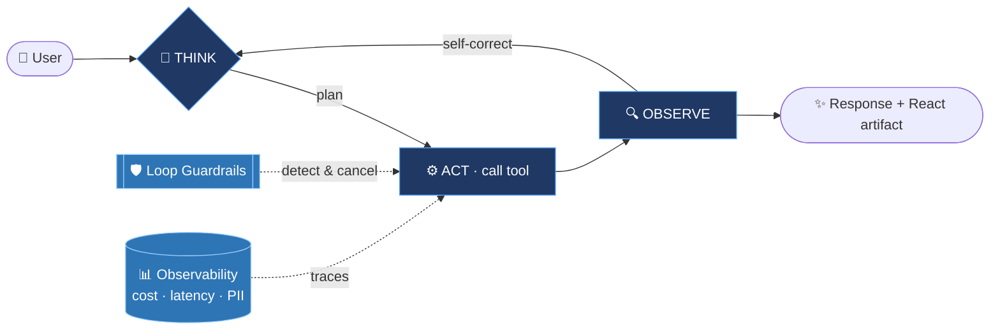

<!-- =========================  CUSTOM ANIMATED HEADER  ========================= -->
<!-- header.svg must live in the repo root alongside this README -->
<p align="center">
  
</p>

<!-- =========================  TYPING SUBTITLE  ========================= -->
<div align="center">

[](https://faiz.live)

<!-- =========================  SOCIAL BADGES  ========================= -->
<a href="https://faiz.live"></a>
<a href="https://linkedin.com/in/faizitguy"></a>
<a href="mailto:faiz.itguy@gmail.com"></a>


</div>

---

## 🧠 About Me

```python
class FaizKhan:
    role        = "Full-Stack AI Engineer"
    i_build     = ["Full-stack AI products", "LLM agents", "RAG systems"]
    i_ensure    = ["Reliability", "Observability", "Security", "Cost control"]
    stack       = ["Python", "FastAPI", "LangGraph", "React", "Node.js", "AWS", "Azure"]
    cert        = "AWS Certified AI Practitioner"
    mission     = "Take an AI idea from a blank repo to something users trust."
    open_to     = "AI Engineer roles · India & Gulf / Remote"
```

> A flashy LLM demo takes a weekend. An AI product people can actually depend on — one that ships
> end to end *and* won't loop endlessly, burn the budget, or leak data — takes real engineering.
> **That whole journey is what I do.**

- 🤖 6+ years shipping software; the last few building **full-stack AI products** end to end — agent backends in **Python/FastAPI**, real-time **React** frontends, infra on **AWS & Azure**.
- 🧠 I design **LLM agents** (LangChain, LangGraph, MCP) and **RAG / knowledge systems** over **Claude (AWS Bedrock)** and OpenAI.
- 🛡️ I make AI **production-grade** — guardrails, observability, security, and test coverage that keep it reliable and affordable.
- ✍️ I write about AI engineering on [LinkedIn](https://linkedin.com/in/faizitguy) and [faiz.live](https://faiz.live).

---

## 🎯 What I Bring

<table>
<tr>
<td width="33%" valign="top" align="center">

### 🧩 Build Full-Stack AI
End-to-end AI products — agent loops & APIs in **Python/FastAPI**, real-time **React** UIs, cloud infra on **AWS/Azure**. From idea to production.

</td>
<td width="33%" valign="top" align="center">

### 🛡️ Make It Production-Grade
**Guardrails** that stop runaway loops, **LLM observability** (cost · latency · PII), security hardening, and **1,500+ test** suites.

</td>
<td width="33%" valign="top" align="center">

### 🔎 RAG & Knowledge Systems
Retrieval-augmented assistants with **vector search** (Pinecone, Qdrant) — e.g. **+45%** documentation retrieval on a live platform.

</td>
</tr>
</table>

---

## 🔁 How I Build Agents That Don't Break



<sub>The loop above is the real architecture behind my flagship work — a LangGraph agent over Claude with guardrails and observability bolted on so it stays reliable and affordable in production.</sub>

---

## 🛠️ Tech Stack

#### 🧠 AI / GenAI


#### 💻 Languages


#### ⚙️ Backend & Data


#### 🎨 Frontend


#### ☁️ Cloud & DevOps


---

## 🚀 Featured Work

<table>
<tr>
<td width="50%" valign="top">

### 🤖 Vericast Marketing Strategist (vAI)
A production conversational-AI platform on a **LangGraph** agentic loop over **Claude (AWS Bedrock)** — 30+ tools, subagents, SSE streaming to React.
- Built an **agent-loop guardrails framework** that killed a recurring ~$946/2-week token-waste problem & 1M+ token blowouts.
- Shipped self-hosted **Langfuse observability** (cost, latency, PII redaction).
- Authored the **1,500+ test** backend.

`Python` `FastAPI` `LangGraph` `Claude` `PostgreSQL` `React`

</td>
<td width="50%" valign="top">

### 🏛️ Imperium — Trust Management Platform
Full-stack platform handling **£6B+** in trust funds annually (PT Trustees, UK).
- Integrated **LLM assistants** (OpenAI, LangChain, MCP) into internal tools.
- Built a **RAG knowledge bot** (Pinecone) — +45% doc retrieval.
- Ran AWS at **99.99% uptime**; IaC with Terraform.

`Node.js` `React` `LangChain` `Pinecone` `AWS` `Terraform`

</td>
</tr>
</table>

> 🔗 More projects, write-ups, and demos on **[faiz.live](https://faiz.live)**

---

## 📊 GitHub Stats

<div align="center">


</div>

---

## 📜 Certifications

| Credential | Issuer |
| :--- | :--- |
| 🏅 **AWS Certified AI Practitioner** | Amazon Web Services |
| 🏅 **Agentic AI** | DeepLearning.AI (Andrew Ng) |

---

<div align="center">

### 🤝 Let's build something intelligent together

<a href="https://linkedin.com/in/faizitguy"></a>
<a href="https://faiz.live"></a>

<br/><br/>

<i>"Can you trust the output, can you afford it, and can you prove both?" — the questions I build around.</i>


</div>
